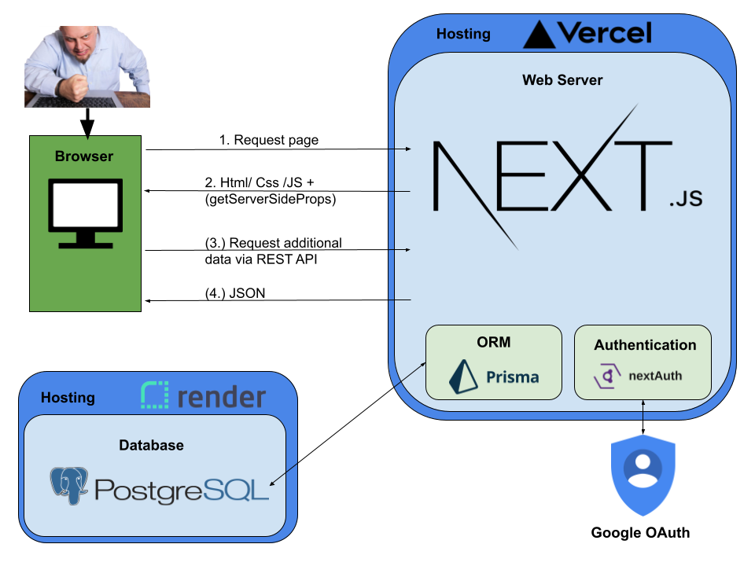

# Spata

  

## How to set up locally
### Prerequisites

- Please make sure yarn is installed on your system
- Please make sure you have a stable version of Node.js installed on your system (version 12, 14 or 16)
- clone the git repo and access the project folder (cd spata)
### Set up locally
1. Add the .env file that was provided to you ( .../spata/.env)

2. Install the dependencies
```bash
$ yarn
```

3. Generate the Prisma Client
```bash
$ yarn prisma generate
```

4. Run the development server
```bash
$ yarn dev
```

Now you can open [http://localhost:3000](http://localhost:3000) in your browser to see the app.


## Architecture

  
  

